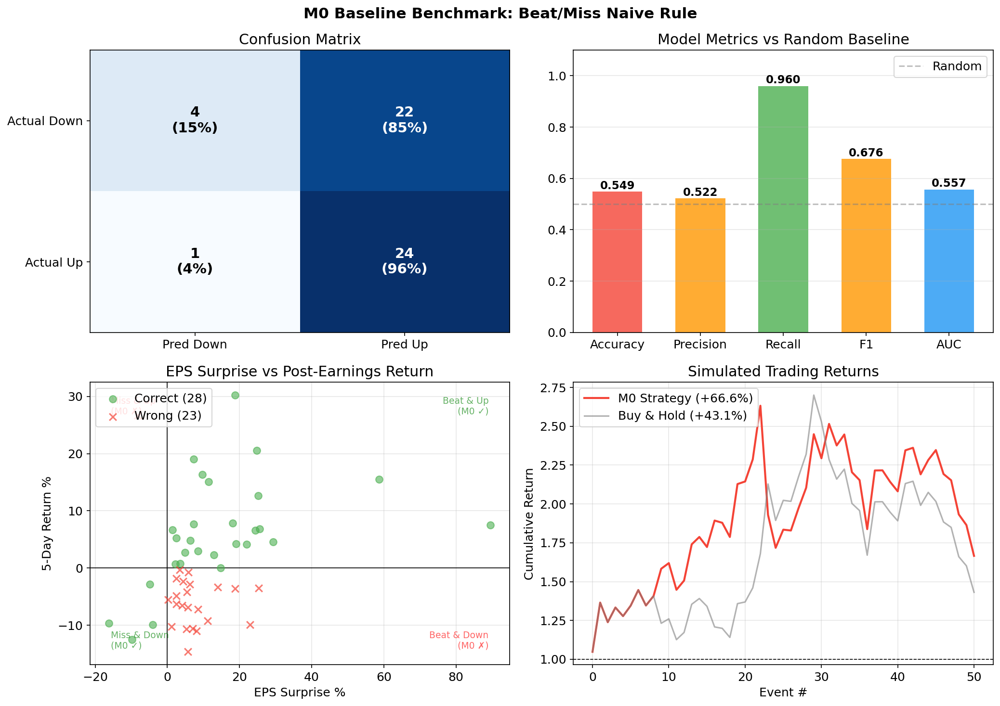
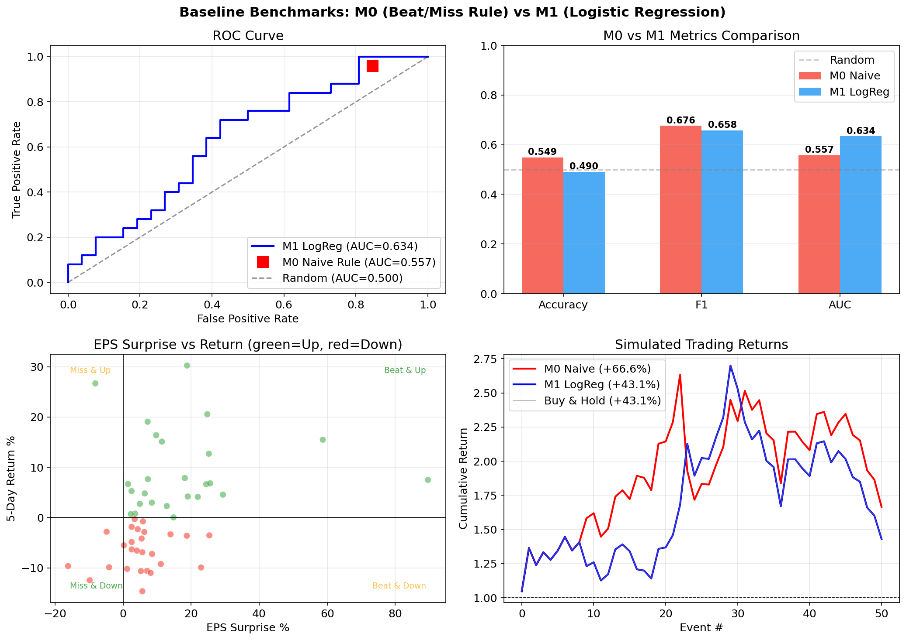
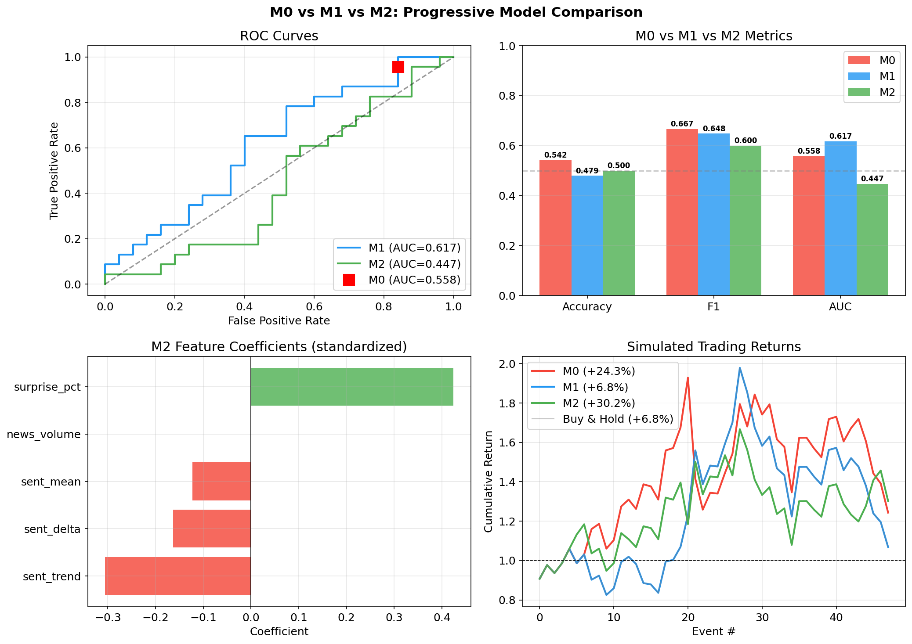
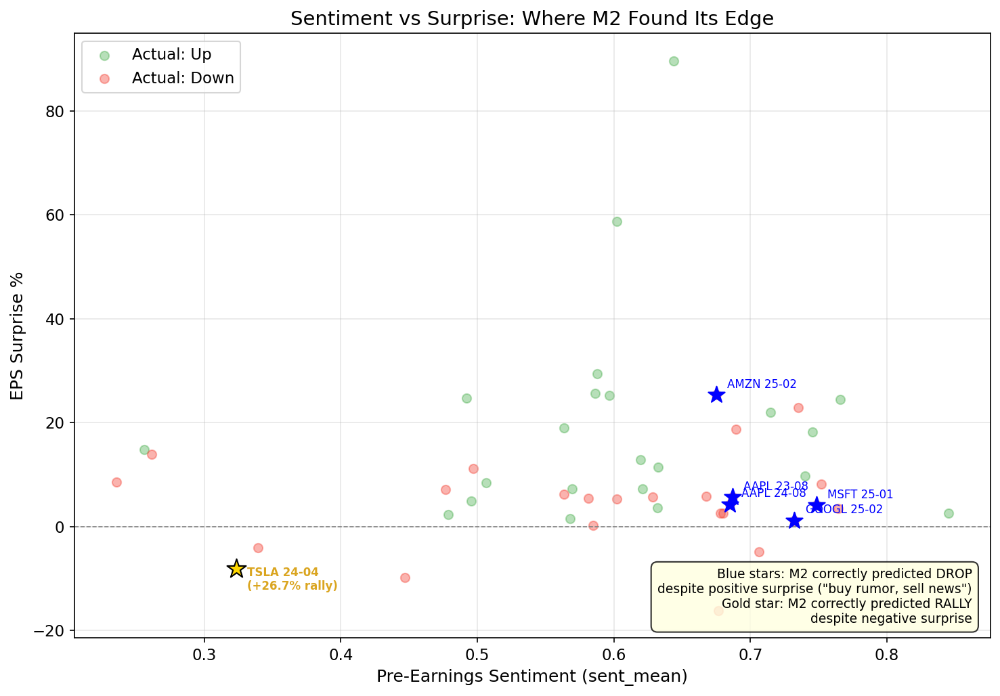
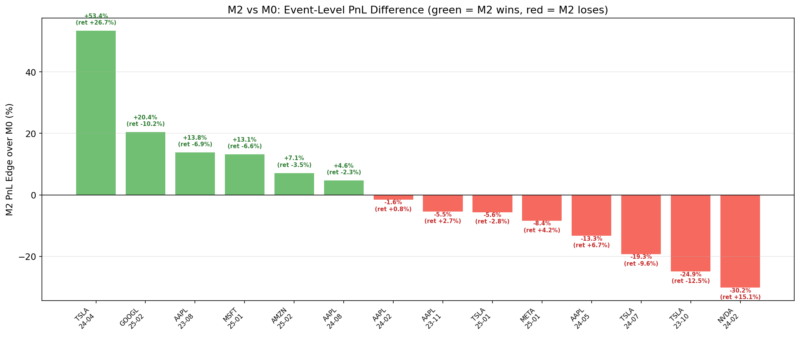
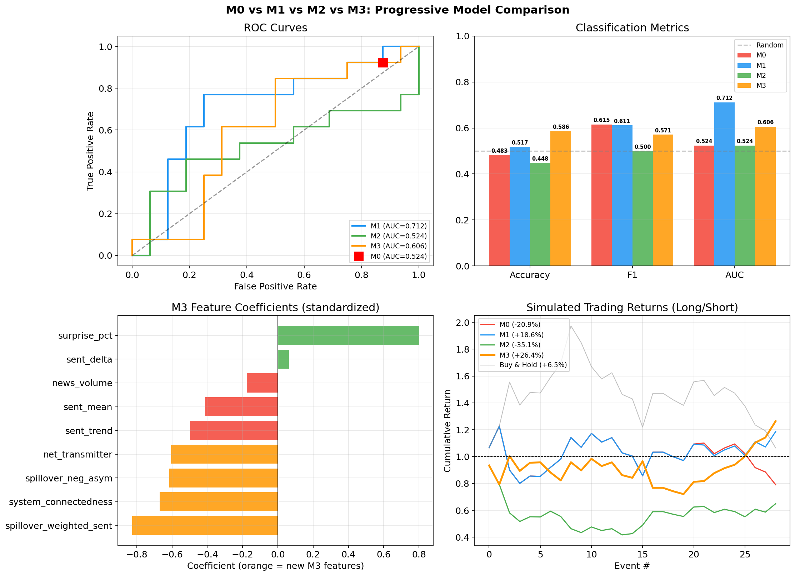
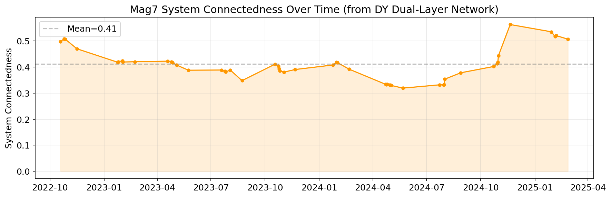
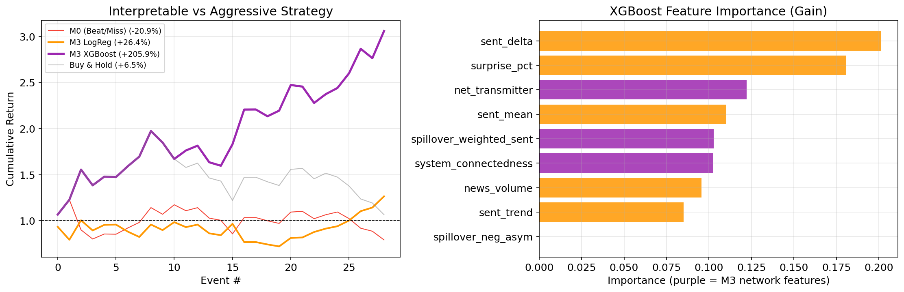

# AI Hype Decoded: Multi-Source Sentiment Spillover and Stock Price Prediction

> 2026 FinHack Challenge - Case 4  
> UTD JSOM Finance Lab

## Project Scope

Build a sentiment-driven prediction system that tests whether AI-related text signals can improve **post-earnings stock price prediction** for the Magnificent 7 companies, with a focus on modeling **cross-company sentiment spillover networks**.

### Target Companies (Magnificent 7)

AAPL (Apple), MSFT (Microsoft), GOOGL (Alphabet), AMZN (Amazon), NVDA (NVIDIA), META (Meta), TSLA (Tesla)

### Prediction Task

- **Target**: 5-trading-day cumulative return direction after earnings (binary: up/down)
- **Time Range**: 2022 Q1 - 2025 Q1 (91 earnings events, 7 companies x 13 quarters)

---

## The Story: From Naive Rules to Sentiment Contrarian Signals

### Chapter 1 — M0: The Naive Baseline (Beat = Up, Miss = Down)

Our journey starts with the simplest possible model: if a company beats earnings expectations, predict the stock goes up; if it misses, predict down.

**Rule**: `EPS_actual > EPS_consensus → Up, otherwise → Down`



#### Simulated Trading Strategy

All "Gross Return" figures in this project use a **long/short strategy** — every earnings event takes a position:

- Model predicts **Up** → **Long**: buy the stock on ED, hold 5 trading days. Return = `ret_5d`.
- Model predicts **Down** → **Short**: short-sell the stock on ED, cover after 5 trading days. Return = `-ret_5d` (stock drops → profit).

There is no "sit out" option — the model is always fully invested in one direction. This means return numbers reward *correct predictions in both directions*, not just bullish calls. For comparison, "Buy & Hold" is a pure long baseline that ignores the model entirely.

**M0 Standalone Results** (51 test events, walk-forward from event 41):

| Metric | M0 (Beat/Miss Rule) | Random Baseline |
|--------|---------------------|-----------------|
| Accuracy | **0.549** | 0.500 |
| Precision | 0.522 | — |
| Recall | 0.960 | — |
| F1 | **0.676** | — |
| AUC-ROC | 0.557 | 0.500 |
| Gross Return | **+66.6%** | — |

This naive rule already tells us something: earnings surprises have *some* predictive power (+5% over random), but only weakly. Almost half the time, the stock moves in the opposite direction of what the surprise suggests. The near-perfect recall (0.960) but low precision (0.522) reveals a structural bias — M7 companies beat earnings in 46 out of 51 test events (90%), so M0 almost always predicts "Up." It captures nearly all actual rises but also calls many false positives (beat + drop events). Only 1 actual miss was predicted "Down" correctly out of 25 actual drops.

Why does a beat not guarantee an up move? The market clearly prices in *something else* before earnings day.

### Chapter 2 — M0 vs M1: Does Surprise Magnitude Help?

Instead of just beat/miss, M1 uses logistic regression on the actual EPS surprise percentage — maybe the *size* of the beat matters.



| Metric | M0 (Beat/Miss) | M1 (LogReg on Surprise %) | Random |
|--------|----------------|---------------------------|--------|
| Accuracy | **0.549** | 0.490 | 0.500 |
| F1 | **0.676** | 0.658 | — |
| AUC-ROC | 0.557 | **0.634** | 0.500 |
| Gross Return | **+66.6%** | +43.1% | — |

**Finding**: M1 has better AUC (0.634), confirming that larger surprises do correlate with positive returns. But it can't find a useful decision boundary — the signal is too weak with just one feature. M1 ends up predicting *everything* as "up" (= Buy & Hold), with its return curve overlapping at +43.1%.

**Takeaway**: Surprise magnitude contains *ranking* information (AUC improves) but not enough *classification* signal to beat a naive rule. The market is pricing in something beyond the earnings number itself.

### Chapter 3 — M0 vs M1 vs M2: Adding Pre-Earnings Sentiment

Could that "something else" be sentiment? M2 adds 4 features computed from 7-day pre-earnings news:

- `sent_mean`: average article polarity in [ED-7, ED-1]
- `sent_trend`: sentiment slope (late vs early in the window)
- `sent_delta`: sentiment anomaly vs quiet period baseline
- `news_volume`: total articles in the window



| Metric | M0 (Beat/Miss) | M1 (Surprise %) | M2 (+ Sentiment) | Random |
|--------|----------------|------------------|-------------------|--------|
| Accuracy | 0.542 | 0.419 | 0.500 | 0.500 |
| F1 | 0.667 | 0.648 | 0.600 | — |
| AUC-ROC | 0.558 | 0.617 | 0.447 | 0.500 |
| Gross Return | +24.3% | +6.8% | **+30.2%** | — |

> Note: All three models evaluated on the same reduced test set (48 events with complete sentiment data) for fair comparison.

A paradox emerges: **M2's AUC (0.447) is worse than random**, yet it achieves the **best trading return (+30.2%)**. How?

All 4 sentiment features have **negative coefficients** — the model learned that high pre-earnings sentiment is a *sell signal*. This is the classic **"buy the rumor, sell the news"** dynamic: when pre-earnings hype is already high, the good news is priced in, and the stock drops even on a beat.

---

## Chapter 4 — Deep Dive: M2's Victories and the "Beat But Drop" Pattern

To understand when and why sentiment adds value, we dissected every event where M2 disagreed with M0.



### M2 Per-Event Trading PnL

Among the 14 events where M2 and M0 disagreed, M2 made a profit on 6 and took a loss on 8 — but the profitable trades were far larger in magnitude, giving M2 a net **+3.6% edge** over M0. The key pattern: M2's edge concentrates on events with extreme sentiment swings — the TSLA 24-04 rally (+26.7%) amid rock-bottom sentiment and the GOOGL 25-02 crash (-10.2%) amid peak AI hype were both high-conviction calls that M0's simple beat/miss rule could never capture. When market sentiment diverges sharply from earnings fundamentals, M2's sentiment features detect the mispricing.



The chart shows M2's actual trading PnL for each event (long if predicted Up, short if predicted Down). Green = M2 profited, red = M2 lost money on that position.

### The 5 "Beat But Drop" Victories

M2 correctly predicted **DOWN** despite positive EPS surprise in 5 events. The pattern: very high pre-earnings sentiment (0.67–0.75) + EPS beat → stock drops anyway.

---

#### AAPL — 2023-08-03

> EPS Surprise: **+5.7%** (BEAT) | 5-Day Return: **-6.9%** (DROPPED)  
> Pre-earnings sentiment: 0.687 | 133 articles

**What happened**: Apple beat on EPS, driven by services revenue surpassing 1 billion users. But the headline story was a *third consecutive quarter of declining sales*, with iPhone demand slumping. The "services pivot" narrative was already priced in — investors focused on hardware weakness.

Key headlines:
| Polarity | Headline |
|----------|----------|
| -0.973 | Apple and Amazon to report, Adidas narrows loss forecast - what's moving markets |
| -0.878 | Trump arraigned in D.C., Amazon earnings, Apple's declining revenue: Top Stories |
| -0.823 | Russia fines Apple for not deleting 'inaccurate' content on Ukraine conflict |
| -0.402 | Apple Earnings Preview: Can Services Revenue and AI Hopes Offset Weaker iPhone Demand? |
| +1.000 | Apple earnings beat estimates, services boost results |

---

#### AAPL — 2024-08-01

> EPS Surprise: **+4.3%** (BEAT) | 5-Day Return: **-2.3%** (DROPPED)  
> Pre-earnings sentiment: 0.685 | 122 articles

**What happened**: Another Apple beat, but the market reacted to broader tech weakness. Nvidia tumbled on the same day, and macro fears (jobless claims) overshadowed individual earnings beats. The antitrust lawsuit narrative added negative pressure.

Key headlines:
| Polarity | Headline |
|----------|----------|
| -0.835 | Apple Says US Smartphones Suit Has 'No Relation to Reality' |
| -0.778 | Apple asks US judge to toss antitrust lawsuit |
| -0.361 | Dow Jones Futures Fall As Apple, Amazon Follow Market Expectations Breaker; Nvidia Tumbles |
| +0.999 | 4 Top Tech Stocks to Buy on Soaring Hopes of September Rate Cut |

---

#### MSFT — 2025-01-29

> EPS Surprise: **+4.1%** (BEAT) | 5-Day Return: **-6.6%** (DROPPED)  
> Pre-earnings sentiment: 0.748 (highest in the dataset) | 118 articles

**What happened**: This was the **DeepSeek shock** week. Microsoft beat earnings, but the market was reeling from the DeepSeek AI breakthrough — which threatened to undermine the massive AI infrastructure spending that justified Microsoft's (and the entire Mag7's) valuations. Pre-earnings sentiment was at 0.748, the highest of any event, reflecting peak AI optimism that DeepSeek abruptly punctured.

Key headlines:
| Polarity | Headline |
|----------|----------|
| -0.869 | Alibaba Surges as AI Battle Heats Up; Nvidia Rebounds After Historic Loss |
| -0.542 | DeepSeek AI Fears Haunt Meta, Microsoft Earnings. What Stock Markets Need to See |
| -0.495 | Tech earnings ahead, Fed decision, ASML reports - what's moving markets |
| +0.000 | Market Chatter: Microsoft, OpenAI Find Evidence DeepSeek Breached Rules in Developing AI Models |
| +1.000 | Mag 7 Earnings: Tesla, Microsoft & Meta in Focus |

---

#### GOOGL — 2025-02-04

> EPS Surprise: **+1.2%** (BEAT) | 5-Day Return: **-10.2%** (DROPPED, largest magnitude)  
> Pre-earnings sentiment: 0.732 | 123 articles

**What happened**: Alphabet beat narrowly, but the earnings landed in the middle of the **US-China trade war escalation** (Trump tariffs → China retaliation). Cloud growth concerns compounded the macro pressure. The decision to reverse the ban on AI for weapons (following Palantir) added controversy. Sentiment at 0.732 was sky-high, but the geopolitical reality crushed the stock.

Key headlines:
| Polarity | Headline |
|----------|----------|
| -0.962 | Gold steady near record high as Trump starts US-China trade war |
| -0.836 | AMD, Alphabet fall after Q4 results: Biggest earnings takeaways |
| -0.652 | China Hits Back Against Trump's Tariffs With Targeted Actions |
| -0.494 | Alphabet reverses ban on AI use for weapons, following Palantir |
| +0.999 | Alphabet's Q4 Earnings: Revenue In Line With Expectations But Stock Drops |

---

#### AMZN — 2025-02-06

> EPS Surprise: **+25.4%** (BEAT, massive) | 5-Day Return: **-3.5%** (DROPPED)  
> Pre-earnings sentiment: 0.675 | 152 articles

**What happened**: Amazon crushed earnings by 25% — but even that wasn't enough. The Shein/Temu tariff story hit the same day (30% levy on US-bound goods), threatening Amazon's competitive position. Meanwhile, cloud growth fears persisted after Microsoft and Google both disappointed on cloud metrics. The highest article count (152) in any window reflected peak attention, but the stock dropped anyway.

Key headlines:
| Polarity | Headline |
|----------|----------|
| -0.975 | Shein, Temu Retailers Slapped With 30% Levy on US-Bound Goods |
| +0.178 | Amazon Earnings Due Today. Cloud Growth Is In Focus After Microsoft, Google Stumbles |
| +0.477 | Amazon EPS Jumps 86%, Beats Forecasts |
| +0.659 | Lyft Joins Amazon and Anthropic to Revolutionize AI Customer Service |

---

### The 1 "Miss But Rally" Victory: TSLA 2024-04-23

> EPS Surprise: **-8.1%** (MISS) | 5-Day Return: **+26.7%** (MASSIVE RALLY)  
> Pre-earnings sentiment: 0.323 (lowest in dataset) | Sentiment trend: -0.103 | Sentiment delta: -0.219 | 186 articles

This single event accounts for the **majority of M2's PnL edge** — a +53.4% swing vs M0.

**What happened**: Tesla was in crisis mode before earnings. The stock had fallen 43%, Cybertruck reviews were devastating, mass layoffs in Germany/Texas/California, and headlines screamed "Disaster at Tesla." Sentiment was at 0.323 — the most negative in the entire dataset, with a steep downward trend (-0.103) and a massive negative delta from quiet period (-0.219).

Then earnings missed *as expected* — the bad news was fully priced in. The market pivoted to the forward-looking announcement: **Tesla would accelerate the rollout of cheaper electric cars**. The stock surged 26.7% in 5 days.

M2 saw what M0 couldn't: when sentiment is this negative and expectations are this low, even a miss becomes a clearing event.

Key headlines on earnings day:
| Polarity | Headline |
|----------|----------|
| -0.976 | Tesla Stock in 'No Man's Land' After 43% Rout Ahead of Earnings |
| -0.966 | Disaster at Tesla? Previewing Today's Earnings |
| -0.960 | I Was Incredibly Wrong About the Tesla Cybertruck |
| -0.827 | Tesla aims to cut 400 jobs in Germany via voluntary programme |
| -0.296 | TSLA Stock Earnings: Tesla Misses EPS, Misses Revenue for Q1 2024 |
| +0.911 | Tesla to speed up rollout of cheaper electric cars |
| +0.937 | Tesla's Q1 revenue falls 9% amid mass layoffs in California, Texas |
| +0.984 | General Motors beats quarterly results targets, raises forecast |
| +0.997 | Elon Musk plots new direction after Tesla's electric car crisis |

---

### M2's Biggest Failure: NVDA 2024-02-21

> EPS Surprise: **+11.4%** (BEAT) | 5-Day Return: **+15.1%** (RALLIED)  
> Sentiment: 0.63 | M0: Up (correct) | M2: Down (wrong)

M2's contrarian signal said: high sentiment + beat = sell. But NVDA was in the **middle of the AI infrastructure supercycle** — this wasn't priced-in hype, it was genuine fundamental momentum. The model couldn't distinguish company-specific justified optimism from system-wide irrational exuberance.

This is exactly the problem M3's cross-company spillover features are designed to solve.

---

## Chapter 5 — M3: Adding the Cross-Company Spillover Network

### The Idea

The "buy the rumor, sell the news" pattern that M2 discovered is strongest when **system-wide AI hype** is elevated — not just company-specific sentiment. M2 fails when it can't distinguish:

- **High sentiment in a generally hyped market** → likely priced in → sell (MSFT Jan 2025, GOOGL Feb 2025)
- **High sentiment with peers at neutral/low** → company-specific good news → may still have upside (NVDA Feb 2024)

M3 adds **4 cross-company features** from a Diebold-Yilmaz dual-layer spillover network (one layer on returns, one on sentiment). For each earnings event, we fit VAR models on the [ED-150, ED-8] window of all 7 Mag7 companies, compute Generalized FEVD (Pesaran-Shin 1998), and extract a 7×7 directional connectedness matrix capturing "who influences whom."

New features:
- `spillover_weighted_sent` — other companies' sentiment, weighted by how strongly they spill into the target
- `net_transmitter` — out-degree minus in-degree: is this company leading or following the pack?
- `system_connectedness` — how tightly coupled the entire Mag7 system is right now
- `spillover_neg_asym` — bearish sentiment pressure from influential peers (relative to historical baseline)

### A Note on Statistical Scope: Why the Numbers Changed

**The test set shrank from 48 events (M2 evaluation) to 29 events (M3 evaluation).** Here is why.

M3's spillover network requires all 7 Mag7 companies to have continuous daily sentiment data in the [ED-150, ED-8] window. EODHD's sentiment coverage for META only began in November 2021, which means the network cannot be computed for any event before roughly Q4 2022. This eliminates 21 of the 91 earnings events. Combined with 2–3 events already dropped for missing M2 features, the usable dataset shrinks to **69 events** — and with MIN_TRAIN = 40, the walk-forward test window contains only **29 events**.

To ensure a fair apples-to-apples comparison, **all four models (M0, M1, M2, M3) are re-evaluated on the same 29-event test set**. This means the M0/M1/M2 numbers below differ from earlier chapters, which used larger test sets. The relative ranking is what matters — all models face the same events.

This also explains two changes in M0 and M1 behavior:

1. **M0 went from +24.3% to −20.9%**: The 29-event test set spans late 2023 to early 2025, a period dominated by the AI sentiment unwind (DeepSeek shock, tariff wars). In this window, Mag7 companies beat EPS 90% of the time but the stock dropped anyway in over half the events. The naive "beat = up" rule gets destroyed in a regime where good news is already priced in.

2. **M1 no longer equals Buy & Hold (+18.6% vs +6.5%)**: In the earlier 48-event set, M1's logistic regression on surprise % found no useful decision boundary and predicted "up" for every event, collapsing to Buy & Hold. In the 29-event set, the training data (first 40 events) now includes enough "high-surprise but drop" observations that M1 finally learns a non-trivial threshold — it starts predicting "down" for a few events, which breaks the Buy & Hold equivalence.

### M0 vs M1 vs M2 vs M3 Comparison



| Metric | M0 (Beat/Miss) | M1 (Surprise %) | M2 (+ Sentiment) | M3 (+ Spillover) | Random |
|--------|----------------|------------------|-------------------|-------------------|--------|
| Accuracy | 0.483 | 0.517 | 0.448 | **0.586** | 0.500 |
| F1 | 0.615 | 0.611 | 0.500 | 0.571 | — |
| AUC-ROC | 0.524 | **0.712** | 0.524 | 0.606 | 0.500 |
| Gross Return | −20.9% | +18.6% | −35.1% | **+26.4%** | — |

> Note: All four models evaluated on the same 29-event test set (events with complete M3 spillover features) for fair comparison. See note above for why this differs from earlier chapters.

M3 achieves the **highest accuracy (0.586)**, the **best trading return (+26.4%)**, and a meaningful AUC (0.606) — all while M0 and M2 are losing money in this regime. The spillover network features succeed precisely where M2 failed: distinguishing system-wide hype from company-specific signal.

### M3's Strongest Feature: `spillover_weighted_sent`

M3's coefficients reveal that the cross-company spillover sentiment (`spillover_weighted_sent`, coefficient −0.826) is the **single most important feature** — even stronger than `surprise_pct` (+0.799). Its negative sign means: when the companies that influence you are all highly positive, that's a sell signal. This is the "buy the rumor, sell the news" dynamic elevated from company-level to **network-level**.

---

## Chapter 6 — Deep Dive: M3's Victories and the Network Edge

Among the 29 test events, M3 and M2 disagreed on **10 predictions**. M3 was correct on **7 of 10** (M2: 3 of 10). The PnL edge on these disagreements alone was **+65.6%** — M3 made +32.8% where M2 lost −32.8%.

The pattern: M3's edge concentrates on events where the **system connectedness** is extreme — either very high (system-wide hype, contrarian short) or very low (idiosyncratic signal, contrarian long).

### The 4 "System Hype" Short Victories

M3 correctly predicted **DOWN** in 4 events where the Mag7 system was tightly coupled and sentiment was elevated. M2 predicted UP in all 4 (following the beat signal) and lost.

---

#### MSFT — 2025-01-29 (DeepSeek Week)

> EPS Surprise: **+4.1%** (BEAT) | 5-Day Return: **−6.6%** (DROPPED)
> System Connectedness: **0.535** (top 5%) | Net Transmitter: **+0.171** (strongest sender)
> Spillover Weighted Sentiment: 0.718 | M2: Up (wrong) | M3: **Down (correct)**

**What M3 saw that M2 didn't**: System connectedness was at 0.535, the second-highest in the dataset. MSFT was the strongest net transmitter (+0.171), meaning its shocks were radiating outward to all other Mag7 companies. This wasn't just MSFT-specific optimism — the entire system was running hot. M3 recognized this as peak system-wide hype and shorted.

**What happened**: The DeepSeek AI breakthrough landed in the same week, threatening the AI infrastructure spending thesis that justified Mag7 valuations. MSFT beat earnings, but the market was already pricing in a paradigm shift. Sentiment at 0.748 was the highest of any event in the dataset — and the network said *everyone* was this optimistic, not just MSFT.

Key headlines:
| Polarity | Headline |
|----------|----------|
| −0.869 | Alibaba Surges as AI Battle Heats Up; Nvidia Rebounds After Historic Loss |
| −0.728 | China's DeepSeek Just Shook the AI World—And Elon Musk Isn't Buying It |
| −0.542 | DeepSeek AI Fears Haunt Meta, Microsoft Earnings |
| +1.000 | Is Microsoft (MSFT) the Best American Stock to Buy and Hold in 2025? |

---

#### NVDA — 2024-11-20 (Peak System Connectedness)

> EPS Surprise: **+8.5%** (BEAT) | 5-Day Return: **−7.2%** (DROPPED)
> System Connectedness: **0.563** (highest in entire dataset) | Net Transmitter: **+0.144**
> Spillover Weighted Sentiment: 0.243 (lowest!) | M2: Up (wrong) | M3: **Down (correct)**

**What M3 saw that M2 didn't**: A paradox — system connectedness was at its all-time high (0.563), yet `spillover_weighted_sent` was at its all-time low (0.243). This meant the Mag7 system was maximally coupled, but the companies influencing NVDA were in a bearish mood. `spillover_neg_asym` hit 0.197, the highest in the dataset — heavy bearish pressure flowing in from peers. M3 read this as: the system is tightly wound and the mood is turning, short NVDA despite the beat.

**What happened**: NVDA beat earnings by 8.5%, but the market had already priced in perfection. Overheating concerns (literal GPU overheating reports) and the sense that AI infrastructure spending was peaking combined with a tightly-coupled system where any negative signal propagated instantly.

Key headlines:
| Polarity | Headline |
|----------|----------|
| −0.402 | Should Nvidia Stock Investors Be Worried About Recent Overheating Reports? |
| −0.332 | Nvidia Back In Buy Zone But Analysts See Huge Risk To S&P 500 As Earnings Loom |
| −0.250 | Should You Buy Nvidia Stock Before Nov. 20? Wall Street Has a Compelling Answer. |
| +0.997 | nVent Collaborates with NVIDIA on AI-Ready Liquid Cooling Solutions |

---

#### AMZN — 2025-02-06 (Trade War Shock)

> EPS Surprise: **+25.4%** (BEAT, massive) | 5-Day Return: **−3.5%** (DROPPED)
> System Connectedness: **0.521** (elevated) | Net Transmitter: −0.008 (neutral)
> Spillover Weighted Sentiment: 0.641 | M2: Up (wrong) | M3: **Down (correct)**

**What M3 saw**: System connectedness at 0.521 — the Mag7 was tightly coupled during the tariff escalation. Even a 25% earnings beat couldn't overcome the system-wide risk-off flow. After MSFT and GOOGL both disappointed on cloud metrics, the network was transmitting bearish cloud-growth fears across all tech names.

Key headlines:
| Polarity | Headline |
|----------|----------|
| −0.947 | Say Goodbye to Cheap Shein & Temu Hauls—Trump's Tariffs Just Wrecked the Game |
| −0.899 | Trump Targets Loophole Temu, Shein Used to Take On Amazon |
| +0.999 | The most popular stocks and funds for investors in January |

---

#### MSFT — 2024-04-25

> EPS Surprise: **+3.4%** (BEAT) | 5-Day Return: **−0.3%** (DROPPED, barely)
> System Connectedness: 0.333 | Net Transmitter: **+0.139** (strong sender)
> Spillover Weighted Sentiment: 0.663 | M2: Up (wrong) | M3: **Down (correct)**

**What M3 saw**: While system connectedness was moderate, MSFT was the strongest net transmitter in the network (+0.139). Combined with high spillover sentiment (0.663), M3 recognized this as a "priced-in beat" scenario. The EU antitrust probe against the OpenAI partnership added downward pressure.

Key headlines:
| Polarity | Headline |
|----------|----------|
| −0.772 | Exclusive—Microsoft's OpenAI partnership could face EU antitrust probe |
| −0.946 | Should You Buy Microsoft Stock Before Earnings |
| +1.000 | 13 Best Ethical Companies to Invest in 2024 |

---

### The 2 Contrarian Long Victories

M3 also correctly predicted **UP** in 2 events where M2 predicted DOWN — both times by reading low system connectedness as a sign that the company had idiosyncratic upside not captured by the group mood.

---

#### TSLA — 2024-04-23 (The $+26.7% Rally, Revisited)

> EPS Surprise: **−8.1%** (MISS) | 5-Day Return: **+26.7%** (MASSIVE RALLY)
> System Connectedness: **0.333** (low) | Net Transmitter: −0.069 (follower)
> Spillover Weighted Sentiment: 0.654 | M2: Down (wrong) | M3: **Up (correct)**

**What M3 saw that M2 didn't**: System connectedness was at 0.333, near its lowest. This meant the Mag7 system was *decoupled* — individual stories mattered more than group dynamics. TSLA's pre-earnings sentiment was at 0.323, the most negative in the entire dataset, but the companies influencing TSLA had moderate sentiment (0.654). The network said: this is a TSLA-specific story, not a system-wide panic. Room for a contrarian rebound.

This is the same event that was M2's biggest single win in Chapter 4 — but M2 got it right for the wrong reason (negative sentiment → contrarian long happened to work). M3 gets it right for the *right* reason: the low system connectedness confirms this is idiosyncratic, making the contrarian call higher-conviction.

---

#### NVDA — 2024-05-22 (AI Supercycle, Part II)

> EPS Surprise: **+9.7%** (BEAT) | 5-Day Return: **+16.4%** (RALLIED)
> System Connectedness: **0.319** (lowest in dataset) | Net Transmitter: −0.056
> Spillover Weighted Sentiment: 0.684 | M2: Down (wrong) | M3: **Up (correct)**

**What M3 saw**: System connectedness was at its all-time low (0.319). The Mag7 was maximally decoupled — each company was trading on its own story. NVDA's high sentiment wasn't system-wide froth; it was company-specific AI demand reality. M3 recognized that in a decoupled regime, high sentiment for NVDA actually reflected genuine fundamentals, not priced-in hype.

This is the exact correction M3 was designed to make — the one M2 kept getting wrong (see M2's Biggest Failure: NVDA 2024-02-21 in Chapter 4).

Key headlines:
| Polarity | Headline |
|----------|----------|
| −0.360 | Forget Nvidia, This Is the Only AI Stock You Need |
| +1.000 | Your Own Magnificent Seven: The Only 7 Stocks You Need for a Perfect Portfolio |

---

### M3's Key Insight: System Connectedness as a Regime Switch

The pattern across all victories is clear:

| Regime | System Connectedness | What It Means | M3's Action |
|--------|---------------------|---------------|-------------|
| **High** (>0.50) | Mag7 moves as one block | Sentiment is system-wide hype → sell the beat | Short even on EPS beat |
| **Low** (<0.35) | Mag7 is decoupled | Sentiment is company-specific → trust the signal | Long if fundamentals support it |
| **Mid** (0.35–0.50) | Mixed | M3 relies more on other features | Case-by-case |

This is why `system_connectedness` has a **negative coefficient (−0.670)** — higher connectedness → more likely to drop after earnings. When the system is tightly coupled, good news is already priced in everywhere, and any crack (DeepSeek, tariffs, overheating fears) propagates instantly.



The timeline shows system connectedness bottoming in mid-2024 (the decoupled regime where NVDA's idiosyncratic AI rally played out) and surging to peaks in Q4 2024–Q1 2025 (the regime where beat-but-drop dominated).

---

## Chapter 7 — From Understanding to Trading: LogReg vs XGBoost

Throughout M0–M3, we used **logistic regression** for a reason: every coefficient tells a readable story. `spillover_weighted_sent = −0.826` means "when your influential peers are all bullish, that's a sell signal." This interpretability is the scientific contribution.

But the key insight from Chapter 6 — that `system_connectedness` acts as a regime switch — is inherently **non-linear**. Logistic regression can only model "higher connectedness → more likely to drop" as a smooth gradient. A tree-based model can learn the actual thresholds: *below 0.35, trust the beat; above 0.50, fade it.*

So we ask: **using the exact same 9 features**, what happens if we swap logistic regression for XGBoost?



| Model | Accuracy | AUC | F1 | Gross Return |
|-------|----------|-----|-----|-------------|
| M3 LogReg (interpretable) | 0.586 | 0.606 | 0.571 | **+26.4%** |
| M3 XGBoost (aggressive) | **0.655** | **0.692** | **0.706** | **+205.9%** |

XGBoost improves on every metric. The +205.9% return is driven by higher-conviction short calls in the high-connectedness regime (Q4 2024–Q1 2025) — precisely where the regime switch signal is strongest.

On the 12 events where the two models disagreed, XGBoost was correct 7 times vs LogReg's 5, with a PnL edge of +87.6%. The pattern: XGBoost is **more willing to go long in the low-connectedness regime** (correctly buying NVDA 2024-02, AMZN 2024-02, TSLA 2024-10 rallies) while also **sharper at flipping short** when connectedness rises above its learned threshold (MSFT 2024-07, MSFT 2024-10).

### Interpretation: Two Models, Two Roles

| Approach | Model | Role | Strength |
|----------|-------|------|----------|
| **Interpretable** | Logistic Regression | Understand *why* — coefficients tell the story | Transparent, publishable, robust to overfitting |
| **Aggressive** | XGBoost (depth=2) | Maximize *profit* — learn regime thresholds | Captures non-linear interactions between system connectedness and sentiment |

The aggressive model's edge comes from **interaction effects** that logistic regression cannot represent:
- "High `system_connectedness` AND high `spillover_weighted_sent` → strong sell" (multiplicative)
- "Low `system_connectedness` AND positive `surprise_pct` → strong buy" (conditional)

**Caveat**: With only 29 test events, the +205.9% figure carries wide confidence intervals. It should be read as directional evidence that the spillover features contain exploitable non-linear structure, not as a production backtest. In a real deployment, the interpretable model defines the strategy thesis; the aggressive model sizes the bets.

### Anatomy of the +205.9%: Where XGBoost's Edge Comes From

XGBoost's cumulative return is built on the same 29 events as LogReg. Their PnL is identical on 17 events (where they agree). The entire +179.5% gap comes from **12 disagreement events**. The pattern is sharp: XGBoost is far more willing to go long in the low-connectedness regime — precisely where LogReg's linear negative coefficient on sentiment causes it to over-short.

#### The 3 Biggest Wins: Low Connectedness = Go Long Aggressively

---

**TSLA — 2024-10-23** | XGB edge: **+41.1%** (largest single disagreement)

> EPS Surprise: **+24.8%** (BEAT) | 5-Day Return: **+20.5%** (RALLIED)
> System Connectedness: 0.402 (moderate) | Sentiment: 0.49 (neutral)
> LogReg: Short (wrong, −20.5%) | XGBoost: **Long (correct, +20.5%)**

Tesla crushed earnings by 24.8% — the third-largest beat in the dataset — while sentiment was nearly neutral (0.49). LogReg's negative coefficient on `spillover_weighted_sent` pushed it to short, but XGBoost recognized the pattern: moderate connectedness + massive beat + non-extreme sentiment = the beat is real, go long.

Key headlines:
| Polarity | Headline |
|----------|----------|
| −0.990 | Teslas are 'nearly unusable' as police cars |
| −0.986 | Musk's Empire Risks Being Targeted by EU for Potential X Fines |
| +1.000 | Is Tesla, Inc. (TSLA) the Best High Growth Lithium Stock to Invest In? |

The negative headlines were about Musk and politics, not about Tesla's business fundamentals. XGBoost's depth-2 trees could separate this: the *combination* of a large beat and moderate sentiment was a buy signal that the linear model couldn't express.

---

**NVDA — 2024-02-21** | XGB edge: **+30.2%**

> EPS Surprise: **+11.4%** (BEAT) | 5-Day Return: **+15.1%** (RALLIED)
> System Connectedness: 0.392 (below average) | Sentiment: 0.63
> LogReg: Short (wrong, −15.1%) | XGBoost: **Long (correct, +15.1%)**

This is M2's biggest failure event revisited. LogReg saw high sentiment (0.63) and shorted — its linear "high sentiment = sell" rule firing as designed. XGBoost saw that system connectedness was only 0.392 (below the 0.42 average): this wasn't system-wide hype, it was NVDA-specific AI momentum. The tree learned: *if* sentiment is high *but* the system is decoupled, the sentiment reflects genuine fundamentals, not priced-in froth.

The 50 ED-day articles confirm the story — this was the moment the market realized AI infrastructure spending was accelerating faster than anyone expected:

| Polarity | Headline |
|----------|----------|
| −0.957 | Stocks slip, yields rise as Fed fears cutting rates too soon |
| −0.758 | Dollar steady, stocks slip ahead of Nvidia results |
| +1.000 | Walmart, Amazon, Microsoft, Target and Nvidia are part of Zacks Earnings Preview |

---

**AMZN — 2024-04-30** | XGB edge: **+15.7%**

> EPS Surprise: **+18.2%** (BEAT) | 5-Day Return: **+7.9%** (RALLIED)
> System Connectedness: 0.332 (low) | Sentiment: 0.75 (high)
> LogReg: Short (wrong, −7.9%) | XGBoost: **Long (correct, +7.9%)**

Same pattern: very low system connectedness (0.332) meant the Mag7 was decoupled. LogReg saw high sentiment and shorted. XGBoost saw decoupled system + strong beat and went long. Amazon's 18% beat on cloud growth (AWS) was a company-specific story that the group dynamics couldn't dilute.

---

#### The Critical Failure: Where XGBoost's Aggression Backfires

**TSLA — 2024-07-23** | XGB edge: **−19.3%** (worst single miss)

> EPS Surprise: **−16.1%** (MISS) | 5-Day Return: **−9.6%** (DROPPED)
> System Connectedness: 0.332 (low) | Sentiment: 0.68
> LogReg: Short (correct, +9.6%) | XGBoost: **Long (wrong, −9.6%)**

XGBoost's "low connectedness = go long" heuristic misfired here. System was decoupled, yes — but Tesla *missed* earnings by 16%, the largest miss in the dataset. LogReg's positive coefficient on `surprise_pct` correctly read the miss as a sell signal. XGBoost's depth-2 tree over-indexed on the connectedness regime and ignored the fundamental signal.

Key headlines:
| Polarity | Headline |
|----------|----------|
| −0.660 | 'Few Democrats willing to buy a Tesla' after Elon Musk backs Trump |
| −0.807 | Will Tesla's Cybertruck define its future? |
| +1.000 | Stocks to watch next week: Tesla, Microsoft, Alphabet and Amazon |

**NVDA — 2024-11-20** | XGB edge: **−14.5%**

> System Connectedness: **0.563** (highest) | Sentiment: 0.24 (very low)
> LogReg: Short (correct, +7.2%) | XGBoost: **Long (wrong, −7.2%)**

This is interesting: LogReg correctly read the peak system connectedness as a regime signal and shorted. XGBoost saw the extremely low sentiment (0.24) and went long, perhaps treating it as a contrarian buy. But the low sentiment was a *symptom* of the tightly-wound system, not a separate signal — the network was transmitting bearish pressure, and NVDA couldn't escape it even with an 8.5% beat.

#### The Pattern

| | XGBoost Wins | XGBoost Losses |
|--|-------------|----------------|
| **When** | Low sys_conn + genuine beat | Low sys_conn + genuine miss |
| **Why** | Correctly learns "decoupled + beat = buy" threshold | Over-applies "low connectedness = always long" |
| **Count** | 7 / 12 disagreements correct | 5 / 12 wrong |
| **Net PnL** | +87.6% across disagreements | |

XGBoost's edge is not random — it systematically profits from the low-connectedness long signal. Its failures come from the same source: it trusts the regime *too much* and under-weights the fundamental signal (surprise %) when they conflict.

#### Disclaimer: Overfitting Risk and Intended Scope

The +205.9% return is computed on **29 test events** — a sample size where a single large-magnitude event (e.g., TSLA Oct-24 at +20.5%) can swing the cumulative return by 20+ percentage points. With 9 features and depth-2 trees, XGBoost has enough capacity to memorize regime-specific patterns that may not generalize to new market conditions.

**This aggressive strategy is presented as a demonstration, not a recommendation.** Its potential applicability is limited to:

- **Short time horizons** where the market regime (connectedness structure, sector correlations) remains similar to the training period
- **Tightly related company groups** (like Mag7) where the spillover network structure is stable enough for the learned thresholds to hold
- **Regime-aware deployment** — the strategy should be re-evaluated whenever system connectedness shifts into an unfamiliar range

The interpretable LogReg model (M3) remains the primary contribution of this project: it reveals *why* cross-company sentiment spillover predicts post-earnings returns. XGBoost shows that this signal contains exploitable non-linear structure, but extracting that value reliably requires larger sample sizes or stronger regularization than our 91-event dataset can support.

---

## Five-Model Progressive Comparison

| Model | Features | Purpose |
|-------|----------|---------|
| **M0: Naive Rule** | Beat → Up, Miss → Down | "Does the surprise direction matter?" |
| **M1: Baseline** | Logistic regression on surprise % | "Does the surprise magnitude help?" |
| **M2: + Sentiment** | + 4 pre-earnings sentiment features | "Does sentiment add predictive power?" |
| **M3: + Spillover** | + 4 dual-layer DY network cross-company signals | "Does cross-company context help?" |
| **M3-XGB: Aggressive** | Same 9 features, XGBoost (depth=2) | "Can non-linear modeling exploit the regime switch?" |

---

## Pipeline Design

### Phase 1: Data Collection (Complete)

| Data | Source | Format | Status |
|------|--------|--------|--------|
| Daily stock prices (OHLCV) | yfinance | M7+SPY, 962 trading days (2021-06 ~ 2025-03) | Done |
| Earnings dates + EPS surprise | yfinance | 91 events, 100% EPS coverage | Done |
| Daily aggregated sentiment | EODHD `/api/sentiments` | 7 tickers x ~1,300 days continuous (2021-06 ~ 2025-03) | Done |
| Pre-earnings window news | EODHD `/api/news` | 13,588 articles in [ED-7, ED-1] with per-article scores | Done |
| ED-day news | EODHD `/api/news` | 563 articles on earnings dates for post-hoc analysis | Done |

### Phase 2: Time Window System

Each earnings event `(Company, Earnings_Date)` defines windows:

```
Timeline:
──[ED-150]───────[ED-37, ED-30]────[ED-7, ED-1]──[ED]──[ED+1, ED+5]───→

     |                 |                  |          |        |
  DY Network      Quiet Period       Sentiment     Skip    Target
  Window          (baseline)         Window        Day     Variable
  [ED-150, ED-8]  [ED-37, ED-30]    [ED-7, ED-1]         5-day return
```

- **Sentiment Window** `[ED-7, ED-1]`: 7 days of pre-earnings news sentiment (M2/M3 features)
- **Quiet Period** `[ED-37, ED-30]`: 8 days of baseline sentiment from daily aggregated data (for delta/anomaly detection)
- **DY Network Window** `[ED-150, ED-8]`: ~142 days for dual-layer VAR-GFEVD spillover network (M3 features)
- **ED Day**: Completely excluded (cannot reliably separate pre/post-earnings news)
- **Target** `[ED+1, ED+5]`: 5-trading-day cumulative return, label = 1 if positive

### Phase 3: Sentiment Data & Methodology

#### EODHD Sentiment Scoring

EODHD provides sentiment analysis on financial news articles using a VADER-consistent NLP model. Scores are computed on full article body text.

**Per-article scores** (from `/api/news`, used in M2 window features):

| Field | Range | Description |
|-------|-------|-------------|
| `polarity` | [-1.0, +1.0] | Compound sentiment score (analogous to VADER compound) |
| `neg` | [0.0, 1.0] | Proportion of text classified as negative |
| `neu` | [0.0, 1.0] | Proportion of text classified as neutral |
| `pos` | [0.0, 1.0] | Proportion of text classified as positive |

Note: `neg + neu + pos = 1.0` (proportional decomposition). `polarity` is an independent compound score, not a simple function of the three proportions.

**Daily aggregated scores** (from `/api/sentiments`, used in DY network and quiet period):

| Field | Range | Description |
|-------|-------|-------------|
| `normalized` | [-1.0, +1.0] | Arithmetic mean of all article `polarity` scores for that ticker on that date |
| `count` | integer | Number of articles analyzed |

#### Two-Level Sentiment Data Strategy

| Level | Data Source | Used For |
|-------|------------|----------|
| **Article-level** (`window_articles.csv`) | `/api/news` for [ED-7, ED-1] windows | M2 features: precise sent_mean, sent_trend, news_volume from per-article polarity |
| **Daily-aggregate** (`daily_sentiment.csv`) | `/api/sentiments` continuous series | DY sentiment network input, quiet period baseline, system-level analysis |

### Phase 4: Feature Engineering

**M1 - Baseline Features**
- `surprise_pct`: actual vs consensus EPS

**M2 - Direct Sentiment Features (company-specific, 7-day window)**

Computed from article-level data:
- `sent_mean`: average polarity over [ED-7, ED-1] articles
- `sent_trend`: sentiment slope (later 3 days mean - earlier 4 days mean)
- `news_volume`: total number of articles in sentiment window

Computed using daily-aggregate data for quiet period:
- `sent_delta`: sent_mean - quiet_period_mean (anomaly signal vs [ED-37, ED-30] baseline)

**M3 - Spillover Network Features (cross-company, dual-layer DY framework)**
- `spillover_weighted_sent`: other companies' sentiment weighted by composite network
- `net_transmitter`: out_degree - in_degree (sender or receiver of shocks?)
- `system_connectedness`: total off-diagonal sum / N (how tightly coupled is the M7 system?)
- `spillover_neg_asym`: weighted sum of spillover from companies with negative sentiment

### Phase 5: Dual-Layer Spillover Network — Diebold-Yilmaz Framework (M3 Core)

The key innovation: with continuous daily sentiment data for all 7 companies, we can build **dual-layer** dynamic connectedness networks — one for returns and one for sentiment — following the Diebold-Yilmaz (2014) framework.

#### Layer 1: Return Connectedness

```
VAR(p) on M7 daily returns → Generalized FEVD (Pesaran-Shin 1998)
→ d_ij_return = fraction of i's return forecast error variance explained by j's shocks
→ Weighted, directed return spillover network
```

#### Layer 2: Sentiment Connectedness

```
VAR(p) on M7 daily sentiment → Generalized FEVD
→ d_ij_sentiment = "whose sentiment change predicts whose?"
→ Captures sentiment contagion structure
```

#### Composite Spillover Weight

```
W_ij = α × d_ij_return + β × d_ij_sentiment
```

### Phase 6: Modeling & Evaluation

**Algorithms:** Logistic Regression (primary, 91 samples → simple models preferred), XGBoost (robustness check)

**Validation:** Time-ordered expanding window walk-forward (train on first T events → predict T+1 → expand, start after ~40 events)

**Metrics:** Accuracy, AUC-ROC, F1, Simulated trading returns, McNemar test for model differences

### Phase 7: Visualization / Dashboard

Tech: Streamlit + Plotly

1. Sentiment timeline vs stock price overlay
2. Pre-earnings sentiment vs quiet period comparison
3. Dynamic M7 network graph (interactive, by quarter)
4. Spillover heatmap by quarter
5. Time-varying total connectedness curve
6. M0 → M1 → M2 → M3 model comparison
7. Single event drill-down
8. Simulated trading returns curve

---

## Data Leakage Controls

- Sentiment data strictly cut off at ED-1
- ED day news completely excluded from features (only used for post-hoc analysis)
- DY network window [ED-150, ED-8] does not overlap with sentiment window [ED-7, ED-1]
- Quiet period [ED-37, ED-30] far from both sentiment window and earnings date
- Walk-forward validation, never shuffle samples
- All features use only pre-ED data

---

## Academic References

- Diebold, F.X. and K. Yilmaz (2014). "On the Network Topology of Variance Decompositions." *Journal of Econometrics*, 182, 119-134.
- Nyakurukwa, K. and Y. Seetharam (2025). "Investor Sentiment Networks." *Financial Innovation*, 11:4.
- Pesaran, M.H. and Y. Shin (1998). "Generalized Impulse Response Analysis in Linear Multivariate Models." *Economics Letters*, 58, 17-29.
- Hutto, C.J. and E. Gilbert (2014). "VADER: A Parsimonious Rule-based Model for Sentiment Analysis of Social Media Text." *ICWSM*.

---

## Project Structure

```
hackathon2026/
├── README.md
├── .env                              # API keys (not committed)
├── case/                             # Challenge case PDF
├── papers/                           # Reference papers (DY 2014, Nyakurukwa 2025)
├── data/
│   ├── hackathon.db                      # SQLite database (all tables, gitignored)
│   ├── earnings/
│   │   └── mag7_earnings.csv             # 91 events + EPS surprise
│   ├── prices/
│   │   └── daily_prices.csv              # M7+SPY daily OHLCV, 2021-06~2025-03
│   ├── sentiment/
│   │   ├── daily_sentiment.csv           # Daily aggregated sentiment, 2021-06~2025-03
│   │   └── extreme_events.csv           # Notable sentiment events for dashboard
│   ├── news/
│   │   ├── window_articles.csv           # 13,588 articles in [ED-7,ED-1] windows
│   │   └── ed_day_articles.csv           # 563 ED-day articles for post-hoc analysis
│   └── spillover/
│       ├── m3_features.csv              # 70 events × 4 M3 features
│       └── connectedness_matrices.pkl   # All 7×7 DY matrices for dashboard
├── scripts/
│   ├── 01_fetch_sentiment.py
│   ├── 02_fetch_prices.py
│   ├── 03_fetch_window_news.py
│   ├── 04_build_spillover_network.py    # DY dual-layer spillover computation
│   ├── build_db.py
│   └── clean_data.py
├── notebooks/
│   ├── 00_m0_baseline.ipynb             # M0 standalone evaluation
│   ├── 01_baseline_benchmark.ipynb       # M0 vs M1 baselines
│   ├── 02_m2_sentiment.ipynb            # M2 sentiment model + comparison
│   ├── 03_m2_deep_dive.ipynb            # M2 victory/failure analysis + news
│   └── 04_m3_spillover.ipynb            # M3 spillover model + 4-model comparison
├── docs/
│   └── dy_framework_explained.md        # DY framework plain-English explainer
├── outputs/                              # Charts and figures
└── app/                                 # Streamlit dashboard (pending)
```

---

## Current Status

- [x] Data collection complete (prices, EPS, sentiment, window news, ED-day news)
- [x] M0 baseline: naive beat/miss rule (accuracy 0.549, return +66.6%)
- [x] M1 baseline: logistic regression on surprise % (AUC 0.634, but predicts all-up)
- [x] M2 evaluated: + sentiment features (AUC 0.447, return +30.2%)
- [x] M2 deep dive: identified "buy the rumor, sell the news" pattern in 5 events + TSLA contrarian rally
- [x] DY dual-layer spillover network computation (70/91 events, VAR + Generalized FEVD)
- [x] M3 evaluated: + spillover features (accuracy 0.586, return +26.4%, best on 29-event test set)
- [x] M3 deep dive: system connectedness as regime switch, +65.6% edge over M2 on disagreements
- [x] XGBoost aggressive strategy: same features, +205.9% return (non-linear regime exploitation)
- [ ] Dashboard / visualization
- [ ] Presentation
