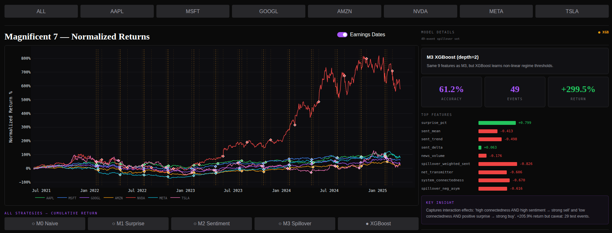
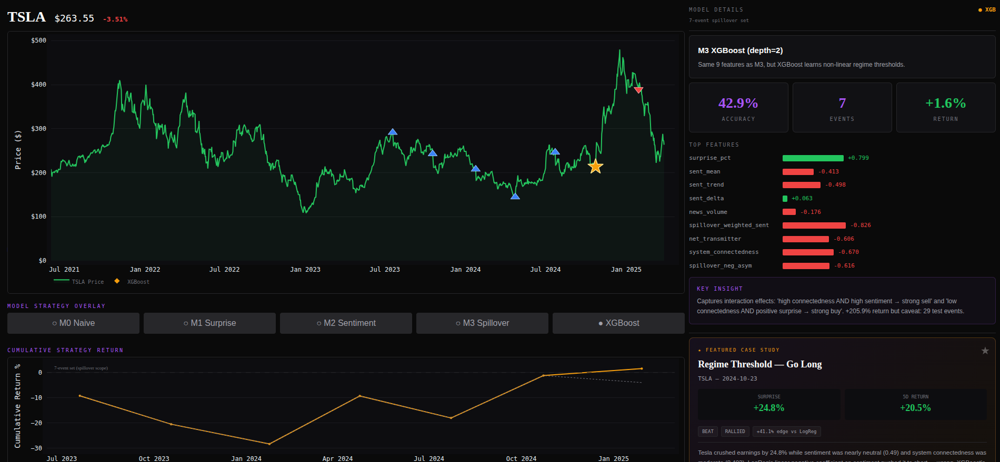
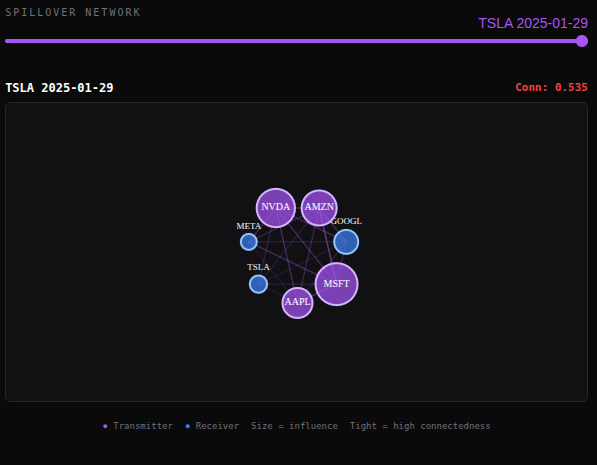
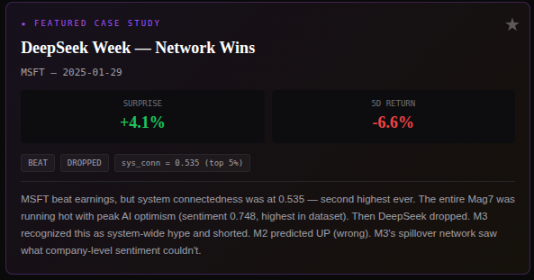
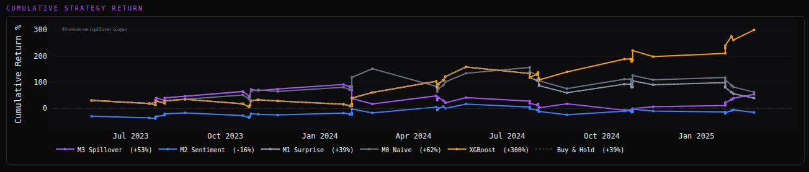

# Spillover Alpha: Sentiment Spillover Network × Post-Earnings Prediction

> 2026 FinHack Challenge — Case 4 | **Team 54** | UTD JSOM Finance Lab  
> **Repository**: https://github.com/Rebas9512/hackathon2026

| Member | Email |
|--------|-------|
| Tu Le | tnl220001@utdallas.edu |
| Yixin Wei | yxw230015@utdallas.edu |
| Ernesto Aguilar | exa200020@utdallas.edu |

---

## Dashboard Preview

An interactive Streamlit dashboard brings the entire analysis to life — from Mag7 normalized returns to per-event drill-downs with model overlays.

### Portfolio Overview — All Magnificent 7



> Normalized return curves for all 7 companies with earnings date markers, model performance metrics, and feature importance at a glance. The right panel shows the active model's accuracy, event count, and gross return alongside a coefficient bar chart.

### Single-Company Deep Dive — TSLA



> Drill into any ticker to see its price history, model prediction overlays, and per-event cumulative return chart. The "Regime Threshold" panel reveals how system connectedness drives the model's long/short decisions.

---

## What This Project Does

We built a sentiment-driven prediction system that tests whether AI-related text signals can improve **post-earnings stock price prediction** for the Magnificent 7 (AAPL, MSFT, GOOGL, AMZN, NVDA, META, TSLA). The key innovation is a **cross-company sentiment spillover network** based on the Diebold-Yilmaz (2014) framework — capturing not just *what* people say about a company, but how sentiment *flows between* companies.

**Prediction task**: 5-trading-day cumulative return direction after earnings (binary: up/down)  
**Data**: 91 earnings events across 7 companies × 13 quarters (2022 Q1 – 2025 Q1)  
**Methodology**: Walk-forward expanding window — no lookahead, no data leakage

---

## The Story: From Naive Rules to Network Intelligence

We tell the story through five progressive models, each adding a layer of signal.

### Chapter 1 — M0: The Naive Baseline

**Rule**: `EPS_actual > EPS_consensus → Up, otherwise → Down`


| Metric | M0 (Beat/Miss Rule) | Random |
|--------|---------------------|--------|
| Accuracy | **0.549** | 0.500 |
| AUC-ROC | 0.557 | 0.500 |
| Gross Return | **+66.6%** | — |

The naive rule works slightly better than a coin flip (+5% over random). But near-perfect recall (0.960) with low precision (0.522) reveals a structural bias — Mag7 companies beat EPS in 90% of test events, so M0 almost always predicts "Up." Half the time, the stock drops anyway.

**Why doesn't a beat guarantee an up move?** The market prices in *something else* before earnings day.

### Chapter 2 — M1: Does Surprise Magnitude Help?

M1 uses logistic regression on EPS surprise percentage — maybe the *size* of the beat matters.


| Metric | M0 (Beat/Miss) | M1 (LogReg on Surprise %) | Random |
|--------|----------------|---------------------------|--------|
| Accuracy | **0.549** | 0.490 | 0.500 |
| AUC-ROC | 0.557 | **0.634** | 0.500 |
| Gross Return | **+66.6%** | +43.1% | — |

M1 has better AUC (0.634) — larger surprises *do* correlate with positive returns — but it can't find a useful decision boundary with just one feature. It predicts everything as "up", collapsing to Buy & Hold.

**Takeaway**: Surprise magnitude contains *ranking* information but not enough *classification* signal. The market is pricing in something beyond the earnings number itself.

### Chapter 3 — M2: Adding Pre-Earnings Sentiment

Could that "something else" be sentiment? M2 adds 4 features from 7-day pre-earnings news:

- `sent_mean`: average article polarity in [ED-7, ED-1]
- `sent_trend`: sentiment slope (late vs early half)
- `sent_delta`: sentiment anomaly vs quiet period [ED-37, ED-30]
- `news_volume`: total articles in the window


| Metric | M0 | M1 | M2 (+ Sentiment) | Random |
|--------|----|----|-------------------|--------|
| Accuracy | 0.542 | 0.419 | 0.500 | 0.500 |
| AUC-ROC | 0.558 | 0.617 | 0.447 | 0.500 |
| Gross Return | +24.3% | +6.8% | **+30.2%** | — |

> All three models evaluated on the same 48-event test set for fair comparison.

A paradox: **M2's AUC (0.447) is worse than random**, yet it achieves the **best trading return (+30.2%)**. All 4 sentiment features have **negative coefficients** — the model learned that high pre-earnings sentiment is a *sell signal*. This is the classic **"buy the rumor, sell the news"** dynamic.

### Chapter 4 — M2 Deep Dive: The "Beat But Drop" Pattern


Among 14 events where M2 and M0 disagreed, M2's profitable trades were far larger in magnitude, giving it a net **+3.6% edge**. The key victories:


**5 "Beat But Drop" Victories** — M2 correctly predicted DOWN despite positive EPS surprise:

| Event | Surprise | 5-Day Return | Sentiment | What Happened |
|-------|----------|-------------|-----------|---------------|
| AAPL 2023-08 | +5.7% | **−6.9%** | 0.687 | Third consecutive quarter of declining sales overshadowed services beat |
| AAPL 2024-08 | +4.3% | **−2.3%** | 0.685 | Broader tech weakness + NVDA tumble + antitrust fears |
| MSFT 2025-01 | +4.1% | **−6.6%** | 0.748 | DeepSeek shock undermined AI spending thesis at peak optimism |
| GOOGL 2025-02 | +1.2% | **−10.2%** | 0.732 | US-China trade war + cloud growth concerns + AI weapons controversy |
| AMZN 2025-02 | +25.4% | **−3.5%** | 0.675 | Shein/Temu tariffs + cloud fears from MSFT/GOOGL misses |

**The Contrarian Rally — TSLA 2024-04-23**: EPS surprise **−8.1%** (miss), yet stock surged **+26.7%**. Sentiment was at 0.323 (lowest in dataset). The bad news was fully priced in; Tesla's announcement of cheaper EVs triggered a massive rally. M2 saw what M0 couldn't: when sentiment is this negative, even a miss becomes a clearing event.

**M2's Biggest Failure — NVDA 2024-02-21**: Sentiment 0.63, M2 shorted, but NVDA was in the AI infrastructure supercycle — genuine momentum, not priced-in hype. M2 couldn't distinguish company-specific justified optimism from system-wide irrational exuberance. **This is exactly the problem M3 solves.**

### Chapter 5 — M3: The Cross-Company Spillover Network

#### The Idea

M2's "buy the rumor, sell the news" pattern is strongest when **system-wide AI hype** is elevated. M2 fails when it can't distinguish:

- **High sentiment in a hyped market** → priced in → sell (MSFT Jan 2025)
- **High sentiment with peers at neutral** → company-specific news → may still rally (NVDA Feb 2024)

#### How the Network Works

> Full technical walkthrough: **[docs/dy_framework_explained.md](docs/dy_framework_explained.md)**

For each earnings event, we build a **dual-layer Diebold-Yilmaz spillover network** from ~142 days of pre-earnings data:

1. **Return layer**: VAR model on 7 Mag7 daily returns → Generalized FEVD → "what fraction of AAPL's volatility is explained by NVDA shocks?"
2. **Sentiment layer**: Same pipeline on daily sentiment → "whose sentiment shift predicts whose?"
3. **Composite**: `W = 0.5 × D_return + 0.5 × D_sentiment`



> Interactive network graph showing Mag7 spillover structure. Node size = influence strength, color = transmitter (purple) vs receiver (blue), edge thickness = spillover weight. Slider lets you explore how the network evolves across earnings events.

From this network we extract 4 new features:

| Feature | Description |
|---------|-------------|
| `spillover_weighted_sent` | Peers' sentiment, weighted by spillover strength into target |
| `net_transmitter` | Out-degree minus in-degree: leader or follower? |
| `system_connectedness` | How tightly coupled the Mag7 system is right now |
| `spillover_neg_asym` | Bearish sentiment pressure from influential peers |

#### Results: 4-Model Comparison

> All models re-evaluated on the same 29-event test set (events with complete M3 features). Numbers differ from earlier chapters due to the reduced test set — see note below.


| Metric | M0 | M1 | M2 | M3 (+ Spillover) | Random |
|--------|----|----|----|--------------------|--------|
| Accuracy | 0.483 | 0.517 | 0.448 | **0.586** | 0.500 |
| AUC-ROC | 0.524 | **0.712** | 0.524 | 0.606 | 0.500 |
| Gross Return | −20.9% | +18.6% | −35.1% | **+26.4%** | — |

M3 achieves the **highest accuracy (0.586)** and **best trading return (+26.4%)** — while M0 and M2 are *losing money* in this regime. The spillover features succeed precisely where M2 failed.

> **Why did M0 go from +66.6% to −20.9%?** The 29-event set spans late 2023–early 2025, a period of AI sentiment unwind (DeepSeek, tariffs). Mag7 companies beat EPS 90% of the time but stocks dropped anyway — the "beat = up" rule gets destroyed when good news is already priced in.

### Chapter 6 — M3 Deep Dive: The Network Edge

Among 29 test events, M3 and M2 disagreed on **10 predictions**. M3 was correct on **7 of 10**, with a PnL edge of **+65.6%**.

#### Featured Case Study: DeepSeek Week



> MSFT 2025-01-29 — EPS beat +4.1%, stock dropped −6.6%. System connectedness at 0.535 (top 5%), sentiment at 0.748 (highest ever). M2 predicted UP (wrong). M3 recognized system-wide hype and shorted (correct). The DeepSeek AI breakthrough landed the same week, threatening the entire AI infrastructure spending thesis.

#### System Connectedness as a Regime Switch

The pattern across all M3 victories:

| Regime | Connectedness | Meaning | M3's Action |
|--------|--------------|---------|-------------|
| **High** (>0.50) | Mag7 moves as one block | System-wide hype → sell the beat | Short even on EPS beat |
| **Low** (<0.35) | Mag7 is decoupled | Company-specific signal → trust it | Long if fundamentals support |
| **Mid** (0.35–0.50) | Mixed | Other features dominate | Case-by-case |


> Connectedness bottoms in mid-2024 (NVDA's idiosyncratic AI rally) and surges to peaks in Q4 2024–Q1 2025 (beat-but-drop regime).

M3's strongest feature is `spillover_weighted_sent` (coefficient −0.826) — when the companies that influence you are all highly positive, that's a sell signal. "Buy the rumor, sell the news" elevated from company-level to **network-level**.

### Chapter 7 — LogReg vs XGBoost: From Understanding to Trading

Logistic regression tells the *why* — every coefficient is interpretable. But the regime switch insight is inherently **non-linear**. Using the exact same 9 features, what happens with XGBoost?


| Model | Accuracy | AUC | Gross Return |
|-------|----------|-----|-------------|
| M3 LogReg (interpretable) | 0.586 | 0.606 | +26.4% |
| M3 XGBoost (aggressive) | **0.655** | **0.692** | **+205.9%** |

#### Cumulative Strategy Returns — All Models



> Walk-forward cumulative returns for all 5 models + Buy & Hold baseline. XGBoost (orange) dramatically separates from the pack in Q4 2024 by aggressively shorting during peak system connectedness and going long in decoupled regimes.

XGBoost's edge comes from **interaction effects** logistic regression cannot represent:
- "High connectedness AND high spillover sentiment → strong sell" (multiplicative)
- "Low connectedness AND positive surprise → strong buy" (conditional)

On the 12 events where the two models disagreed, XGBoost was correct 7 times with a net PnL edge of +87.6%.

| | XGBoost Wins | XGBoost Losses |
|--|-------------|----------------|
| **When** | Low connectedness + genuine beat | Low connectedness + genuine miss |
| **Why** | Correctly learns "decoupled + beat = buy" | Over-applies "low connectedness = always long" |

> **Caveat**: With only 29 test events, the +205.9% figure carries wide confidence intervals. The interpretable LogReg model (M3) remains the primary scientific contribution — it reveals *why* spillover predicts returns. XGBoost demonstrates that exploitable non-linear structure exists, but reliable extraction requires larger samples.

---

## Five-Model Progressive Summary

| Model | Features | Purpose |
|-------|----------|---------|
| **M0: Naive Rule** | Beat → Up, Miss → Down | "Does the surprise direction matter?" |
| **M1: Baseline** | Logistic regression on surprise % | "Does the surprise magnitude help?" |
| **M2: + Sentiment** | + 4 pre-earnings sentiment features | "Does sentiment add predictive power?" |
| **M3: + Spillover** | + 4 dual-layer DY network signals | "Does cross-company context help?" |
| **M3-XGB: Aggressive** | Same 9 features, XGBoost (depth=2) | "Can non-linear modeling exploit the regime switch?" |

---

## Technical Details

### Pipeline Design

```
Timeline per earnings event:
──[ED-150]───────[ED-37, ED-30]────[ED-7, ED-1]──[ED]──[ED+1, ED+5]───→
     |                 |                  |          |        |
  DY Network      Quiet Period       Sentiment     Skip    Target
  Window          (baseline)         Window        Day     Variable
```

| Phase | Description |
|-------|-------------|
| **Data Collection** | Daily prices (yfinance), EPS (yfinance), daily sentiment (EODHD), 13,588 window articles (EODHD) |
| **Feature Engineering** | M1: surprise_pct → M2: + sent_mean, sent_trend, sent_delta, news_volume → M3: + spillover_weighted_sent, net_transmitter, system_connectedness, spillover_neg_asym |
| **Spillover Network** | Dual-layer VAR → Generalized FEVD (Pesaran-Shin 1998) on returns + sentiment, composite weight W = 0.5D_ret + 0.5D_sent |
| **Modeling** | Logistic Regression (primary) + XGBoost (robustness), walk-forward expanding window, MIN_TRAIN = 40 |
| **Evaluation** | Accuracy, AUC-ROC, F1, simulated long/short trading returns |

### Data Leakage Controls

- Sentiment features strictly from [ED-7, ED-1]; ED-day news excluded from all features
- DY network window [ED-150, ED-8] does not overlap with sentiment window
- Walk-forward validation only — never shuffle samples
- All features use exclusively pre-ED data

### Sentiment Data

| Level | Source | Used For |
|-------|--------|----------|
| **Article-level** (per-article polarity) | EODHD `/api/news` | M2 features: sent_mean, sent_trend, news_volume |
| **Daily-aggregate** (normalized sentiment) | EODHD `/api/sentiments` | DY sentiment network, quiet period baseline |

---

## Quick Start

```bash
# Install dependencies
pip install streamlit plotly pandas numpy scikit-learn xgboost networkx

# Launch the dashboard
python run_dashboard.py

# Optional: specify port
python run_dashboard.py --port 8888
```

The dashboard opens at `http://localhost:8501` with a dark terminal-style theme.

---

## Project Structure

```
hackathon2026/
├── README.md
├── run_dashboard.py                      # Dashboard launcher
├── dashboard/
│   ├── app.py                            # Streamlit dashboard (main)
│   ├── charts.py                         # Plotly chart builders
│   └── data_loader.py                    # Data loading + walk-forward predictions
├── data/
│   ├── earnings/mag7_earnings.csv        # 91 events + EPS surprise
│   ├── prices/daily_prices.csv           # M7+SPY daily OHLCV
│   ├── sentiment/daily_sentiment.csv     # Daily aggregated sentiment
│   ├── news/window_articles.csv          # 13,588 pre-earnings articles
│   └── spillover/
│       ├── m3_features.csv               # 70 events × 4 spillover features
│       ├── connectedness_matrices.pkl    # 7×7 DY matrices
│       └── network_snapshots.json        # Network visualization data
├── notebooks/
│   ├── 00_m0_baseline.ipynb              # M0 standalone evaluation
│   ├── 01_baseline_benchmark.ipynb       # M0 vs M1 baselines
│   ├── 02_m2_sentiment.ipynb             # M2 sentiment model
│   ├── 03_m2_deep_dive.ipynb             # M2 victory/failure analysis
│   └── 04_m3_spillover.ipynb             # M3 + 4-model comparison
├── scripts/
│   ├── 01_fetch_sentiment.py
│   ├── 02_fetch_prices.py
│   ├── 03_fetch_window_news.py
│   └── 04_build_spillover_network.py     # DY dual-layer computation
├── docs/
│   └── dy_framework_explained.md         # DY framework plain-English explainer
├── outputs/                              # Generated charts and figures
├── screenshot/                           # Dashboard screenshots
├── case/                                 # Challenge case PDF
└── papers/                               # Reference papers
```

---

## Full Documentation

For a printable version with all charts, case studies, and a complete technical appendix on the Diebold-Yilmaz spillover framework, see **[Spillover_Alpha_Project_Summary.pdf](Spillover_Alpha_Project_Summary.pdf)**.

---

## Academic References

- Diebold, F.X. and K. Yilmaz (2014). "On the Network Topology of Variance Decompositions." *Journal of Econometrics*, 182, 119-134.
- Nyakurukwa, K. and Y. Seetharam (2025). "Investor Sentiment Networks." *Financial Innovation*, 11:4.
- Pesaran, M.H. and Y. Shin (1998). "Generalized Impulse Response Analysis in Linear Multivariate Models." *Economics Letters*, 58, 17-29.
- Hutto, C.J. and E. Gilbert (2014). "VADER: A Parsimonious Rule-based Model for Sentiment Analysis of Social Media Text." *ICWSM*.
